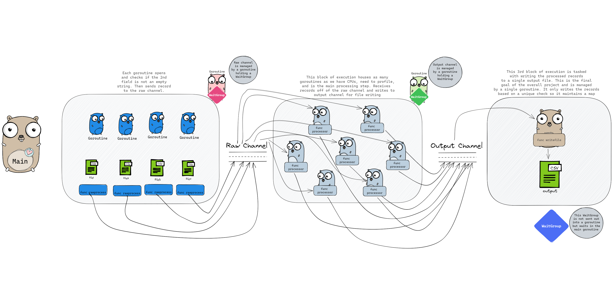

# Processing multiple files concurrently

My main goal was to practice working on processing multiple files concurrently using a single channel to write the results and process.

Using multiple `WaitGroups` feels a bit clunky but the project works.

### TODOS

- [ ] Write tests
- [ ] Benchmark
- [ ] Profile
